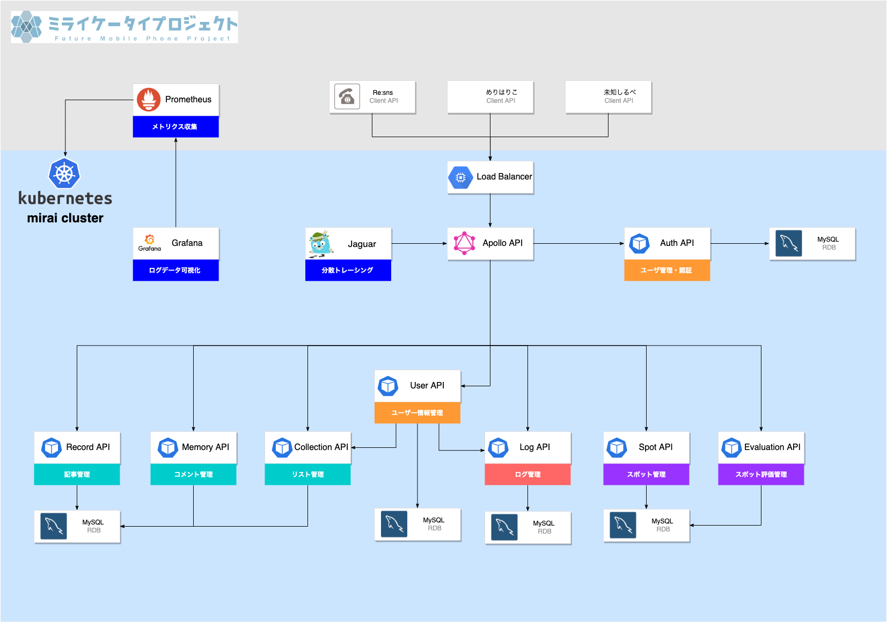

`mirai-cluster`はミライケータイ2020で開発するサービスのバックエンドAPIを[Kubernetes](https://kubernetes.io/)を用いて運用するためのプロジェクトです。  

`mirai-cluster`は、プロジェクトの成果物に基づいて構築されたシステムのアーキテクチャの名前でもあります。  

Table of Contents:
- [Resources](#resources)
  - [Repositories](#repositories)
  - [OSS Web Service](#oss-web-service)
- [Service Overview](#service-overview)
- [Tests](#tests)
- [Directories](#directories)

## Resources
### Repositories
このプロジェクトは、次のようなリポジトリで構成されています。  
- [共通]  [miraikeitai2020/backend-bff](https://github.com/miraikeitai2020/backend-bff)：クライアントが任意のソースからのデータを使用することを容易にするためのAPI。
- [共通]  [miraikeitai2020/backend-auth](https://github.com/miraikeitai2020/backend-auth)：ユーザーを認証・管理するためのAPI。
- [共通]  [miraikeitai2020/backend-user](https://github.com/miraikeitai2020/backend-user)：サービスごとのユーザー情報を管理するためのAPI。
- [Re:sns]  [miraikeitai2020/backend-record](https://github.com/miraikeitai2020/backend-record)：記事を管理するためのAPI。
- [Re:sns]  [miraikeitai2020/backend-memory](https://github.com/miraikeitai2020/backend-memory)：コメントを管理するためのAPI。
- [めりはりこ] [miraikeitai2020/backend-collection]()：ユーザーが所有するリストを管理するAPI。
- [めりはりこ] [miraikeitai2020/backend-log](https://github.com/miraikeitai2020/backend-log)：計測結果・ログ情報を管理するAPI
- [未知しるべ]  [miraikeitai2020/backend-spot](https://github.com/miraikeitai2020/backend-spot)：目的地（スポット）を選出するためのAPI。
- [未知しるべ]  [miraikeitai2020/backend-evaluation](https://github.com/miraikeitai2020/backend-evaluation)：目的地の評価をするためのAPI。
### OSS Web Service
このプロジェクトは、次のようなOSSのWebサービスを使用しています。  
- [prometheus/prometheus](https://github.com/prometheus/prometheus)：システムおよびサービスを監視しメトリクスを収集するために使用します。
- [grafana/grafana](https://github.com/grafana/grafana)：メトリクスを可視化するために使用します。
- [jaegertracing/jaeger](https://github.com/jaegertracing/jaeger)：分散トレースプラットフォーム。マイクロサービスベースの分散システムの監視に使用します。

## Service Overview

## Tests
TBA

## Directories
TBA
